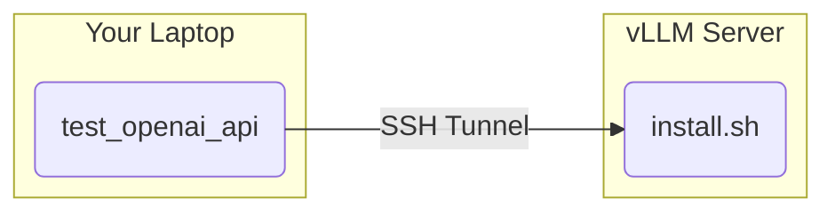

# One-Click Image-Generation Server

One self-contained `install.sh` that deploys a Hugging Face **diffusers** text-to-image
model behind an **OpenAI-compatible** `/v1/images/generations` API, plus client utilities
for testing it from your laptop.

**Currently serving:** `Qwen/Qwen-Image` (20B) — Text-to-Image generation model.
Swap models with one env var: `MODEL_PATH=black-forest-labs/FLUX.2-dev ./install.sh`.

> Note: standard **vLLM cannot serve diffusion image models** (it is a text-LLM engine),
> so this uses `diffusers` under the hood. The container still exposes the same
> OpenAI-style `:8000/v1` API.

## Architecture



The server binds to `0.0.0.0:8000` by default. Use the SSH tunnel, or set `HOST_IP` to bind
to a specific interface.

## Setup

```bash
# Create virtual environment
python3 -m venv .venv

# Activate (Windows: .venv\Scripts\activate)
source .venv/bin/activate

# Install dependencies
pip install -r requirements.txt
```

## Environment Variables

All have sensible defaults; override any by exporting before `./install.sh`.

| Variable | Description | Default |
|----------|-------------|---------|
| `MODEL_PATH` | Hugging Face diffusers repo to serve | `Qwen/Qwen-Image` |
| `SERVED_MODEL_NAME` | Name clients pass as `model` | `Qwen-Image` |
| `GPU_ID` | Which single GPU to use | `0` |
| `NUM_INFERENCE_STEPS` | Sampling steps (quality vs speed) | `50` |
| `TRUE_CFG_SCALE` | Guidance (Qwen-Image) | `4.0` |
| `PORT` | API port | `8000` |
| `HOST_IP` | Bind to a specific interface | `0.0.0.0` |
| `NO_SELF_DESTRUCT` | Set to `1` to disable the auto-stop timer | unset |
| `VLLM_HOST` | Server host for the test client | `127.0.0.1` (tunnel) |
| `REMOTE_HOST` | SSH tunnel remote host | edit tunnel_vllm.sh |

## Server Deployment

Two equivalent ways to run the same server — pick one.

### Option A — One-click `install.sh` (self-contained)

Single file, ideal for `curl | sh` on an ephemeral node. Includes the self-destruct timer
and HF-token prompt. The server code + Dockerfile are embedded in the script.

```bash
./install.sh
```

Override the model or hardware via env vars:

```bash
# Serve FLUX.2-dev instead (32B; needs a gated-repo HF token)
MODEL_PATH=black-forest-labs/FLUX.2-dev SERVED_MODEL_NAME=FLUX.2-dev ./install.sh

# Use a different GPU and fewer steps
GPU_ID=3 NUM_INFERENCE_STEPS=30 ./install.sh
```

### Option B — Docker Compose

Uses `Dockerfile` + `server.py` + `docker-compose.yml`. No self-destruct timer; stop with
`docker compose down`.

```bash
cp .env.example .env        # edit MODEL_PATH / GPU_ID / token as needed
docker compose up -d --build
docker compose logs -f      # wait for "[server] Model ready"
```

Either way: `/v1/models` and `/health` answer immediately; the first image request blocks
until the weights finish loading (watch the logs for `Model ready`).

## Client Usage

### Via SSH Tunnel

```bash
# Start tunnel (set REMOTE_HOST in script or env)
./tunnel_vllm.sh

# Run test (connects to localhost via tunnel)
python test_openai_api.py

# With custom prompt
python test_openai_api.py --prompt "a cat sitting on a windowsill"
```

### Direct Connection

```bash
export VLLM_HOST="<server-ip>"
python test_openai_api.py --host $VLLM_HOST
```

### Browser UI

The server also hosts a minimal web UI — just open the root URL in a browser
(prompt box, size/steps/seed, shows the image inline):

```text
http://<server-ip>:8000/        # or http://localhost:8000/ via the SSH tunnel
```

Note: a text-chat client (Ollama/llama.cpp/OpenAI-chat frontends like Hermes) cannot
drive this server — it only implements image generation (`/v1/images/generations`),
not `/v1/chat/completions`. Use the browser UI above or the OpenAI Images API.

## Files

- `install.sh` - Self-contained one-click deploy (Option A). Embeds the diffusers FastAPI
  server + Dockerfile via heredocs, so it is the only file you need on the server.
- `server.py` - The diffusers OpenAI-compatible image server (used by Compose / Option B).
- `Dockerfile` - Build for the Compose deployment.
- `docker-compose.yml` + `.env.example` - Docker Compose deployment (Option B).
- `tunnel_vllm.sh` - SSH tunnel setup (run on client)
- `test_openai_api.py` - API test client

> `server.py` is duplicated inside `install.sh` (heredoc) so the one-click path stays a
> single file. Keep the two copies in sync when editing the server.
