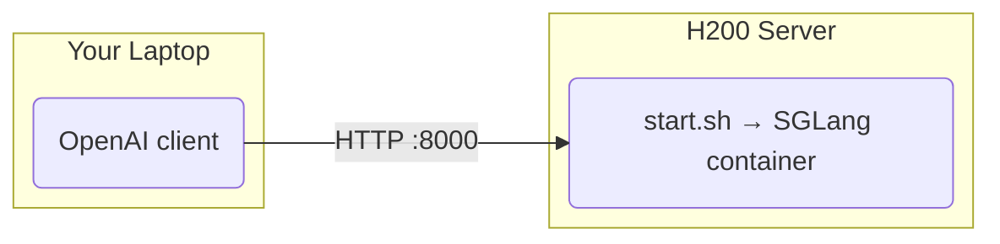

# MiniMax-M2.7 on SGLang (8x H200)

One-command SGLang deployment of [MiniMaxAI/MiniMax-M2.7](https://huggingface.co/MiniMaxAI/MiniMax-M2.7), serving an OpenAI-compatible API.

Recipe: [MiniMax SGLang deploy guide](https://github.com/MiniMax-AI/MiniMax-M2.7/blob/main/docs/sglang_deploy_guide.md).

## Architecture


```mermaid
---
config:
  layout: elk
---
flowchart LR
    subgraph Client ["Your Laptop"]
        A(OpenAI client)
    end

    subgraph Server ["H200 Server"]
        B(start.sh → SGLang container)
    end

    A -- "HTTP :8000" --> B
```

## Server Deployment

Requires Docker + NVIDIA Container Toolkit on the server.

```bash
./install_docker.sh   # one-time; skips anything already installed
cp .env.sample .env   # optional; edit overrides
./start.sh            # streams the boot log, returns once /v1/models answers
./stop.sh
```

First boot downloads ~220GB of weights into `~/.cache/huggingface` (override with `HF_CACHE`).

### Parallelism

| `GPU_ID` | Layout | Notes |
|----------|--------|-------|
| `0,1,2,3,4,5,6,7` (default) | TP8 + EP8 | Guide's 8-GPU cell; most KV cache |
| `0,1,2,3` | TP4 | Fits on 4x H200 (~564GB) |

Other GPU counts are rejected at start.

### Settings (`.env` or shell env)

| Variable | Default | Description |
|----------|---------|-------------|
| `GPU_ID` | `0,1,2,3,4,5,6,7` | GPUs passed to the container |
| `HOST` / `PORT` | `0.0.0.0` / `8000` | API bind address |
| `IMAGE` | `lmsysorg/sglang:v0.5.21` | Needs SGLang >= v0.5.4.post1 |
| `MEM_FRACTION` | `0.85` | `--mem-fraction-static` |
| `REASONING_PARSER` | `minimax-append-think` | `minimax` splits thinking into `reasoning_content` |
| `DFLASH` | `0` | `1` = speculative decoding with [nvidia/MiniMax-M2.7-DFlash](https://huggingface.co/nvidia/MiniMax-M2.7-DFlash) |
| `DRAFT_MODEL` | `nvidia/MiniMax-M2.7-DFlash` | DFlash draft checkpoint |
| `HF_CACHE` | `~/.cache/huggingface` | Host model cache |
| `HF_TOKEN` | unset | Optional (public model) |
| `EXTRA_ARGS` | unset | Extra SGLang flags, appended last |

Thinking: with the default `minimax-append-think` parser, `<think>...</think>` stays inline in `content`. Keep it in the conversation history on later turns, as MiniMax recommends. Tool calling uses `--tool-call-parser minimax-m2`. Send `tools` in the request; no extra flag is needed.

Max context per sequence is 196K tokens.

DFlash (`DFLASH=1`): the draft uses an 8-token block, so start.sh passes 8 verify tokens. It also caps context at 196,608 tokens, the draft's maximum, because SGLang won't start a draft that supports less context than the target model's 204,800. The card reports an acceptance length of about 3.0 (vLLM, TP4, H100). It has not been tested on SGLang with H200 yet. The card marks it as demo-only, and it falls under the NVIDIA evaluation license plus the MiniMax non-commercial license, so it is off by default.

## Test

```bash
curl http://localhost:8000/v1/chat/completions -H "Content-Type: application/json" \
  -d '{"model": "MiniMax-M2.7", "messages": [{"role": "user", "content": "Who won the world series in 2020?"}]}'
```

## Files

- `install_docker.sh`: installs Docker + NVIDIA Container Toolkit (on the H200 host)
- `start.sh` / `stop.sh`: run and stop the SGLang server (on the H200 host)
- `.env.sample`: optional overrides for `start.sh`
